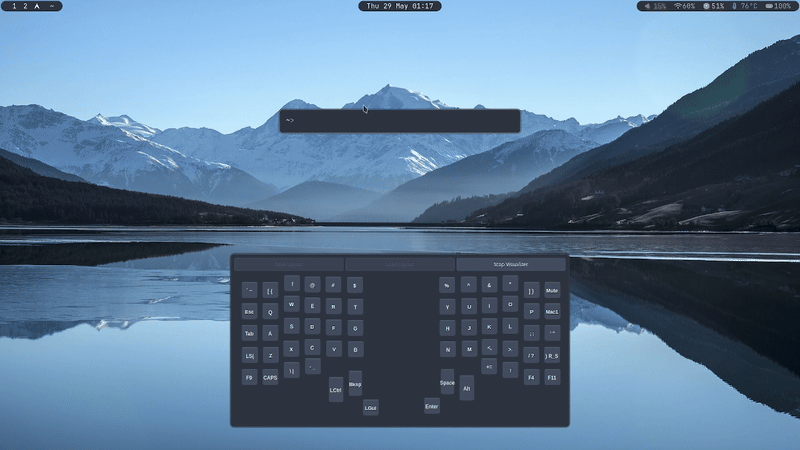
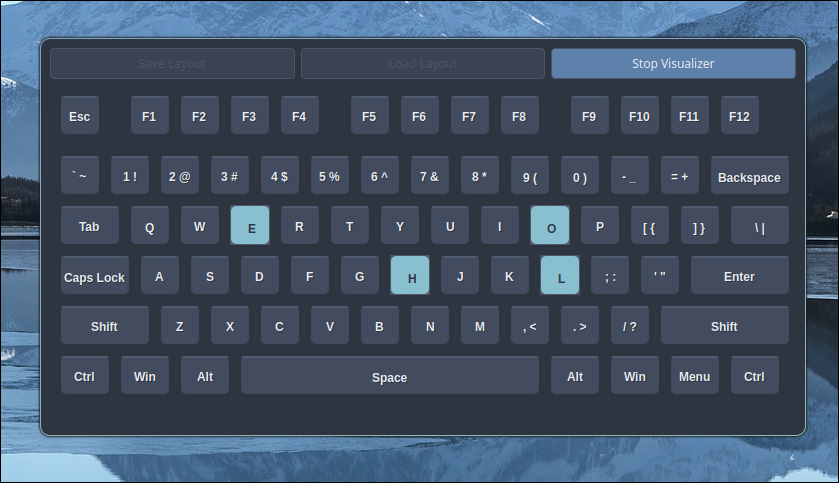
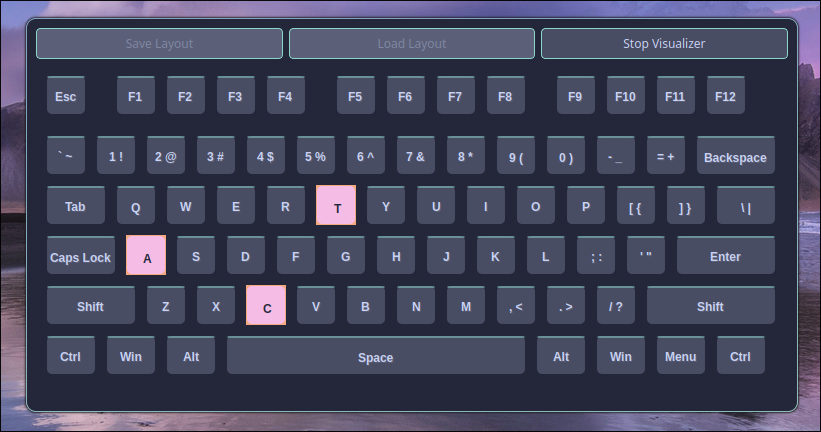

# KeyViz

A PyQt6-based application for visualizing keyboard input in real-time. Features a modern, 3D-styled interface with the Nord color scheme.

## Demo



## Screenshots

### Regular QWERTY Layout



### Dactyl-Manuform Layout
_1.png)

## Features

- Real-time keyboard input visualization
- Custom keyboard layout editor
- Save and load keyboard layouts
- Multi-key selection and movement
- Key resizing with corner handles
- Support for custom key labels and bindings
- Configurable themes and colors

## Configuration

KeyViz uses a JSON configuration system that allows you to customize various aspects of the application (just colors for now)

### Configuring KeyViz

The default configuration is stored in `default_config.json` in the root directory. To change the appearance of the application, you can coppy this file to `home/.config/KeyViz` and edit it there. Note that you can also change the configuration file directly in the root directory, but this is not recommended as you might cause issues with the application if you make a mistake.

1. **Create a configuration file:**
   ```bash
   mkdir -p ~/.config/KeyViz
   cp default_config.json ~/.config/KeyViz/config.json
   ```
2. **Edit the configuration file:**
    - Open `~/.config/KeyViz/config.json` in your favorite text editor
    - Save the file

3. **Apply changes:**
   - Restart the application to apply configuration changes

### Creating Custom Themes

You can create custom color themes by modifying the theme section in the configuration file. The Nord theme is included by default, but you can easily switch to other color schemes or create your own.

## Upcoming Features

- Customizable key colors and styles
- Enhanced key binding options  
- Ability to import and export layouts directly from .vil files
- **Live configuration reload** - Apply settings without restarting
- **Multiple theme presets** - Quick switching between color schemes

## Requirements

- Python 3.8 or higher
- PyQt6
- evdev (for Linux keyboard input)
- sudo privileges (for keyboard monitoring)

## Installation

1. Clone the repository:
   ```bash
   git clone https://github.com/yourusername/keyboard-visualizer.git
   cd keyboard-visualizer
   ```

2. Create a virtual environment (optional but recommended):
   ```bash
   python -m venv venv
   source venv/bin/activate  # On Linux/macOS
   # or
   venv\Scripts\activate  # On Windows
   ```

3. Install dependencies:
   ```bash
   pip install -r requirements.txt
   ```

## Usage

1. Start the application:
   ```bash
   python -m keyboard_visualizer
   ```

2. When prompted, enter your sudo password to allow keyboard monitoring.

3. Use the editor mode to:
   - Click anywhere to add new keys
   - Drag keys to move them
   - Ctrl+Click to select multiple keys
   - Use corner handles to resize keys
   - Double-click keys to edit their label and binding
   - Right-click to delete keys

4. Click "Start Visualizer" to begin monitoring keyboard input.

5. Use "Save Layout" and "Load Layout" to persist your custom layouts.

6. **Configuration**: Edit `default_config.json` to customize the application's appearance and behavior.

## Project Structure

```
keyboard-visualizer/
├── img/                    # Screenshots and demo images
├── layouts/                # Saved keyboard layouts
├── venv/                   # Virtual environment (if created)
├── keyboard_visualizer/    # Main application package
│   ├── core/               # Core functionality
│   │   ├── __init__.py
│   │   └── keyboard_manager.py
│   ├── ui/                 # User interface components
│   │   ├── __init__.py
│   │   ├── dialogs.py
│   │   ├── keyboard_canvas.py
│   │   ├── keyboard_key.py
│   │   └── main_window.py
│   ├── utils/              # Utility functions
│   │   ├── __init__.py
│   │   ├── config.py       # Configuration management
│   │   └── sudo_helper.py
│   ├── __init__.py
│   ├── __main__.py
│   └── default_config.json # Configuration file
├── keyboard_helper.py      # Keyboard helper utilities
├── sudo_helper.py          # Sudo privilege helper
├── requirements.txt        # Python dependencies
└── README.md               # This file
```
